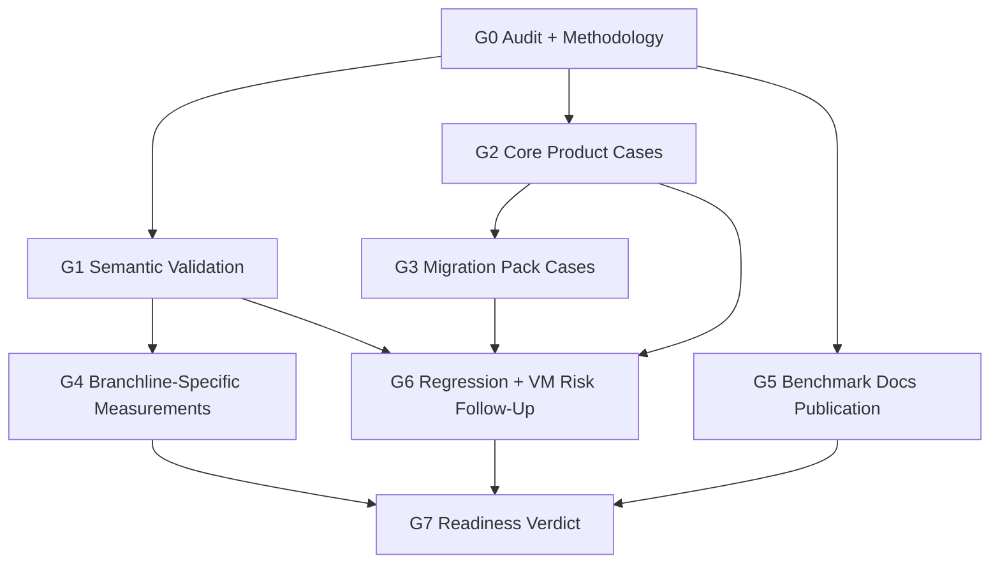

# Branchline Benchmark Readiness - Goal-Mode Agent Chunks

## Purpose

This document splits [Branchline Benchmark Readiness Plan](branchline-benchmark-readiness-plan.md) into chunks that can be given to separate Codex agents running in goal mode.

Each chunk is intentionally scoped so an agent can complete it end-to-end, verify it, and hand off a concise status without needing the whole roadmap in working memory.

## Global Execution Rules

Every goal agent must follow these rules:

1. Run `git status -sb` before editing.
2. Do not edit dirty files unless the orchestrator explicitly confirms the dirty state belongs to this benchmark readiness run.
3. Route repository knowledge changes through `development/` first.
4. Use `./gradlew`, not system Gradle.
5. Do not edit `.env` or any environment variable file.
6. Do not add editor, IDE, LSP, or VS Code scope.
7. Do not make public speed claims unless semantic validation and benchmark evidence support them.
8. Record verification commands and failures in the touched `development/` record.

## Dependency Graph



## Recommended Execution Waves

| Wave | Goal chunks | Parallelism |
| --- | --- | --- |
| 1 | G0 | Run first, single agent. |
| 2 | G1, G2, G5 | Can run in parallel only in separate worktrees; otherwise run sequentially because docs and benchmark files may be dirty. |
| 3 | G3, G4 | G3 after G2; G4 after G1. Can run in parallel if worktrees are isolated. |
| 4 | G6 | Run after G1-G3. |
| 5 | G7 | Run last. |

## G0 - Audit And Methodology

**Goal-mode objective:** Audit existing benchmark coverage and write the comparison methodology contract without changing benchmark code.

**Covers:** B0, B1.

**Allowed files:**

- `development/planning/branchline-benchmark-readiness-plan.md`
- `development/perf/jsonata-benchmarking.md`
- `development/docs/benchmarks-docs-fix-plan.md`

**Do not edit:**

- `jsonata-benchmarks/**`
- `.github/**`
- `docs/**`

**Required read-first files:**

- `jsonata-benchmarks/src/jmh/resources/jsonata-case-matrix.yaml`
- `development/perf/jsonata-benchmarking.md`
- `development/docs/benchmarks-docs-fix-plan.md`
- `docs/benchmarks.md`
- `docs/benchmarks/jsonata.md`
- `development/service/VERIFY.md`

**Steps:**

1. Count and classify existing YAML matrix cases by workload category.
2. Record which current cases are product-representative versus micro/suite coverage.
3. Record blocked comparison conditions: missing external JSONata engines, expected failures, VM fallback/overhead, missing semantic validation.
4. Expand the methodology section in `development/perf/jsonata-benchmarking.md` only if it lacks concrete comparison rules.
5. Update B0/B1 status or notes in `development/planning/branchline-benchmark-readiness-plan.md`.

**Verify:**

```bash
ruby -e 'require "yaml"; YAML.load_file("jsonata-benchmarks/src/jmh/resources/jsonata-case-matrix.yaml"); puts "case matrix yaml ok"'
ruby -e 't=File.read("development/perf/jsonata-benchmarking.md"); abort "missing methodology" unless t.include?("Benchmark readiness methodology"); puts "methodology ok"'
```

**Done when:**

- Existing coverage is classified in a development record.
- Methodology clearly separates execution, parse/compile, inspect/contracts, and publication health.
- No code files changed.

**Suggested goal prompt:**

```text
Goal: Complete G0 from development/planning/branchline-benchmark-agent-goals.md. Audit the existing benchmark surface and strengthen the methodology record without changing benchmark code. Follow AGENTS.md safe edit rules, verify with the two Ruby commands, and update the touched development records with evidence.
```

## G1 - Semantic Output Validation

**Goal-mode objective:** Implement normalized semantic output validation for cross-engine JSON benchmark cases before throughput measurements are accepted.

**Covers:** B3.

**Allowed files:**

- `jsonata-benchmarks/src/jmh/kotlin/io/github/ehlyzov/branchline/benchmarks/jsonata/**`
- `jsonata-benchmarks/src/jmh/resources/jsonata-case-matrix.yaml` only for validation metadata if required
- `development/perf/jsonata-benchmarking.md`
- `development/planning/branchline-benchmark-readiness-plan.md`

**Do not edit:**

- `.github/**`
- `docs/**`
- `interpreter/**` unless a compile error proves the benchmark harness cannot work without a narrow public helper

**Required read-first files:**

- `jsonata-benchmarks/src/jmh/kotlin/io/github/ehlyzov/branchline/benchmarks/jsonata/CrossEngineBenchmark.kt`
- `jsonata-benchmarks/src/jmh/kotlin/io/github/ehlyzov/branchline/benchmarks/jsonata/JsonataBenchmarkSupport.kt`
- `jsonata-benchmarks/src/jmh/kotlin/io/github/ehlyzov/branchline/benchmarks/jsonata/JsonataCaseMatrix.kt`
- `development/language/json-canonicalization.md`
- `development/perf/jsonata-benchmarking.md`

**Steps:**

1. Add a normalized JSON comparison helper for Kotlin values, Branchline results, and JSONata engine results.
2. Validate every prepared case before benchmark measurement where comparable outputs exist.
3. Disable a case/engine on validation failure with a clear report entry.
4. Preserve expected-failure behavior.
5. Add or update focused tests if the module has existing test wiring; if not, add a minimal ad-hoc validation path through `runJsonataMain` or JMH setup evidence.
6. Update development records with validation rules and limitations.

**Verify:**

```bash
./gradlew :jsonata-benchmarks:jmh -PjmhCaseIds=sum_prices,filter_names -PjmhWarmupIterations=1 -PjmhIterations=1
```

**Done when:**

- A semantically mismatched output cannot silently produce a public comparable benchmark row.
- Expected failures still work.
- Verification result is recorded.

**Suggested goal prompt:**

```text
Goal: Complete G1 from development/planning/branchline-benchmark-agent-goals.md. Implement semantic output validation for cross-engine JSON benchmark cases, keep expected failures intact, run the specified Gradle verification, and update development/perf/jsonata-benchmarking.md with evidence.
```

## G2 - Core Product Case Expansion

**Goal-mode objective:** Add the five core representative Tier 1 JSON cases with Branchline programs and Kotlin evaluators.

**Covers:** B2 first half.

**Allowed files:**

- `jsonata-benchmarks/src/jmh/resources/jsonata-case-matrix.yaml`
- `jsonata-benchmarks/src/jmh/kotlin/io/github/ehlyzov/branchline/benchmarks/jsonata/JsonataBenchmarkSupport.kt`
- Optional committed JSON fixture files under `jsonata-benchmarks/src/jmh/resources/` if inline JSON becomes unreadable
- `development/perf/jsonata-benchmarking.md`
- `development/planning/branchline-benchmark-readiness-plan.md`

**Core cases:**

- `etl-order-normalization`
- `large-filter-map-aggregate`
- `contract-drift-projection`
- `numeric-precision-invoice`
- `api-envelope-shaping`

**Steps:**

1. Add one YAML matrix entry per core case with inline JSONata, input JSON, Branchline program, and `kotlinEvalId`.
2. Add Kotlin evaluator functions for each new `kotlinEvalId`.
3. Keep each case semantically comparable across engines.
4. Prefer realistic but compact payloads; do not add huge fixtures in this chunk.
5. Run a narrow benchmark for at least two new cases.
6. Update development records.

**Verify:**

```bash
./gradlew :jsonata-benchmarks:jmh -PjmhCaseIds=etl-order-normalization,numeric-precision-invoice -PjmhWarmupIterations=1 -PjmhIterations=1
```

**Done when:**

- All five core cases compile for Branchline interpreter and VM.
- Kotlin evaluator exists for every case.
- Missing external JSONata engine jars are reported without hiding Branchline/Kotlin results.

**Suggested goal prompt:**

```text
Goal: Complete G2 from development/planning/branchline-benchmark-agent-goals.md. Add the five core Tier 1 product benchmark cases with JSONata expressions, Branchline analogs, and Kotlin evaluators. Verify at least etl-order-normalization and numeric-precision-invoice with Gradle and update development records.
```

## G3 - JSONata Migration Pack Cases

**Goal-mode objective:** Add five migration-story cases that demonstrate moving from JSONata-style mappings to Branchline analogs.

**Covers:** B2 second half.

**Depends on:** G2.

**Allowed files:**

- `jsonata-benchmarks/src/jmh/resources/jsonata-case-matrix.yaml`
- `jsonata-benchmarks/src/jmh/kotlin/io/github/ehlyzov/branchline/benchmarks/jsonata/JsonataBenchmarkSupport.kt`
- `development/perf/jsonata-benchmarking.md`
- `development/planning/branchline-benchmark-readiness-plan.md`

**Case IDs:**

- `jsonata-migration-pack-01`
- `jsonata-migration-pack-02`
- `jsonata-migration-pack-03`
- `jsonata-migration-pack-04`
- `jsonata-migration-pack-05`

**Steps:**

1. Pick five clear migration cases that are not duplicates of the G2 core cases.
2. Keep each case small enough for a reader to understand from the YAML entry.
3. Add Branchline and Kotlin analogs.
4. Add expected failures only when a specific engine cannot honestly support the case.
5. Run a narrow benchmark for all five migration-pack cases.
6. Update development records.

**Verify:**

```bash
./gradlew :jsonata-benchmarks:jmh -PjmhCaseIds=jsonata-migration-pack-01,jsonata-migration-pack-02,jsonata-migration-pack-03,jsonata-migration-pack-04,jsonata-migration-pack-05 -PjmhWarmupIterations=1 -PjmhIterations=1
```

**Done when:**

- Five migration cases exist and run through the configured benchmark harness.
- Each case has a clear one-line reason in the development record.

**Suggested goal prompt:**

```text
Goal: Complete G3 from development/planning/branchline-benchmark-agent-goals.md. Add five JSONata migration-pack cases after G2, each with Branchline and Kotlin analogs, verify all five with Gradle, and update development records.
```

## G4 - Branchline-Specific Measurement Harness

**Goal-mode objective:** Add measurements for Branchline-only strengths without presenting them as JSONata-equivalent comparisons.

**Covers:** B4.

**Depends on:** G1.

**Allowed files:**

- `interpreter-benchmarks/**`
- `vm-benchmarks/**`
- `jsonata-benchmarks/**` only if a shared helper is clearly reusable
- `development/perf/jsonata-benchmarking.md` or a new `development/perf/*.md` record if the work is no longer JSONata-specific
- `development/planning/branchline-benchmark-readiness-plan.md`

**Measurements:**

- `xml-to-json-order`
- `contract-infer-and-diff`
- `inspect-normalize-loop`
- `conversion-loss-audit`
- `canonical-mutation-style`

**Steps:**

1. Decide whether to extend existing JMH benchmark modules or create a focused benchmark class.
2. Add deterministic payloads and programs.
3. Measure inspect/normalize separately from execution.
4. Keep XML/conversion-loss paths on public user-facing surfaces where possible.
5. Document why these are Branchline-specific measurements.
6. Run the relevant JMH task.

**Verify:**

```bash
./gradlew :interpreter-benchmarks:jmh :vm-benchmarks:jmh
```

**Done when:**

- Branchline-only measurements exist with clear names.
- Docs/development records do not imply JSONata equivalence.

**Suggested goal prompt:**

```text
Goal: Complete G4 from development/planning/branchline-benchmark-agent-goals.md. Add Branchline-specific benchmark measurements for XML, contracts, inspect/normalize, conversion-loss audit, and canonical mutation style. Do not present them as JSONata comparisons. Verify with the relevant JMH tasks and update development records.
```

## G5 - Benchmark Docs And Publication Repair

**Goal-mode objective:** Fix benchmark publication/docs plumbing and add representative benchmark framing.

**Covers:** B5 and `development/docs/benchmarks-docs-fix-plan.md` Agents A-E.

**Allowed files:**

- `development/docs/benchmarks-docs-fix-plan.md`
- `.github/workflows/deploy.yml`
- `.github/workflows/release-artifacts.yml`
- `.github/scripts/fetch-benchmark-summaries.sh`
- `.github/scripts/jmh-report.bl`
- `.github/scripts/jsonata-report.bl`
- `docs/benchmarks.md`
- `docs/benchmarks/jsonata.md`
- `README.md` only if benchmark command examples must stay in sync

**Steps:**

1. Fix release links to point to generated HTML directories.
2. Download/copy CSV assets next to release pages.
3. Fix shared-key collision so interpreter-vs-VM comparison can render.
4. Reduce numeric precision in benchmark reports.
5. Make manual `workflow_dispatch` deploy path runnable.
6. Add representative benchmark methodology/framing to public docs.
7. Run docs build.

**Verify:**

```bash
./gradlew docsBuild
```

**Done when:**

- Benchmark pages no longer rely on broken links or missing CSV assets.
- Public docs explain cross-engine versus Branchline-specific measurements.
- No editor/LSP scope appears in benchmark docs.

**Suggested goal prompt:**

```text
Goal: Complete G5 from development/planning/branchline-benchmark-agent-goals.md. Execute the benchmark docs/publication repair tasks, add representative benchmark framing, run docsBuild, and update development/docs/benchmarks-docs-fix-plan.md with evidence.
```

## G6 - Regression And VM Risk Follow-Up

**Goal-mode objective:** Re-check known benchmark credibility risks and either fix them through targeted tasks or document limitations.

**Covers:** B6.

**Depends on:** G1, G2, G3.

**Allowed files:**

- `development/perf/interpreter-performance-tasks.md`
- `development/perf/jsonata-benchmarking.md`
- `development/runtime/runtime-optimizations.md`
- `development/architecture/vm-interpreter-split.md`
- Runtime/VM code only if the agent is explicitly asked to implement a discovered fix

**Steps:**

1. Run current benchmarks for `performance/case001` and `string-concat/case000`.
2. Identify whether the old regression notes still apply on current main.
3. Inspect VM fallback/overhead evidence for public comparison cases.
4. If a narrow code fix is obvious and low-risk, propose it in the development record before changing code.
5. Otherwise, document limitations and recommended follow-up tasks.

**Verify:**

```bash
./gradlew :jsonata-benchmarks:jmh -PjmhCaseIds=performance/case001,string-concat/case000 -PjmhWarmupIterations=1 -PjmhIterations=1
```

**Done when:**

- Current risk status is known.
- Public benchmark notes can distinguish regression, fallback, and expected limitation.

**Suggested goal prompt:**

```text
Goal: Complete G6 from development/planning/branchline-benchmark-agent-goals.md. Re-check performance/case001, string-concat/case000, and VM fallback/overhead risks on current main. Do not make runtime code changes unless you first record a narrow proposed fix in development. Verify with the specified Gradle command and update perf records.
```

## G7 - Benchmark Readiness Verdict

**Goal-mode objective:** Produce the final benchmark readiness verdict and decide whether Branchline DX T9-T18 may resume.

**Covers:** B7.

**Depends on:** G4, G5, G6.

**Allowed files:**

- `development/planning/branchline-benchmark-readiness-plan.md`
- `development/planning/branchline-benchmark-agent-goals.md`
- `development/INDEX.md`
- Related `development/perf/*.md` and `development/docs/*.md` records for final status notes

**Steps:**

1. Read all G0-G6 handoffs.
2. Record verification commands, outputs, skipped checks, and external-engine gaps.
3. List allowed public claims and forbidden claims.
4. Decide one of:
   - `Ready`: resume Branchline DX T9-T18.
   - `Ready with caveats`: resume T9-T18, but keep benchmark caveats visible.
   - `Blocked`: do not resume adoption-facing work until named benchmark blockers are fixed.
5. Update statuses in `development/INDEX.md` only if the readiness increment is complete.

**Verify:**

```bash
ruby -e 'require "yaml"; Dir["development/**/*.{md,yaml}"].each { |f| s=File.read(f); next unless s.start_with?("---\n"); YAML.load(s.split(/^---$/,3)[1]) }; puts "front matter ok"'
```

**Done when:**

- Benchmark readiness status is explicit.
- The next agent can safely start or defer Branchline DX T9.

**Suggested goal prompt:**

```text
Goal: Complete G7 from development/planning/branchline-benchmark-agent-goals.md. Read G0-G6 handoffs, produce the benchmark readiness verdict, update development records and INDEX as appropriate, verify front matter, and state whether Branchline DX T9-T18 may resume.
```

## Orchestrator Checklist

- [x] Start G0.
- [x] Review G0 diff and verification.
- [x] Start G1 and G2, preferably in isolated worktrees if parallel.
- [x] Start G5 once G0 methodology is accepted.
- [x] Start G3 after G2.
- [x] Start G4 after G1.
- [x] Start G6 after G1-G3.
- [x] Start G7 after G4-G6 and G5.
- [x] Permit resuming `development/planning/branchline-dx-implementation-plan.md` at T9 after the G7 verdict.

G7 verdict: Ready with caveats. Branchline DX T9-T18 may resume, but benchmark caveats must stay visible and public speedup/ratio claims remain blocked until validation, disabled/error, VM fallback, execution-state, and impossible-row flags feed the public summaries.
